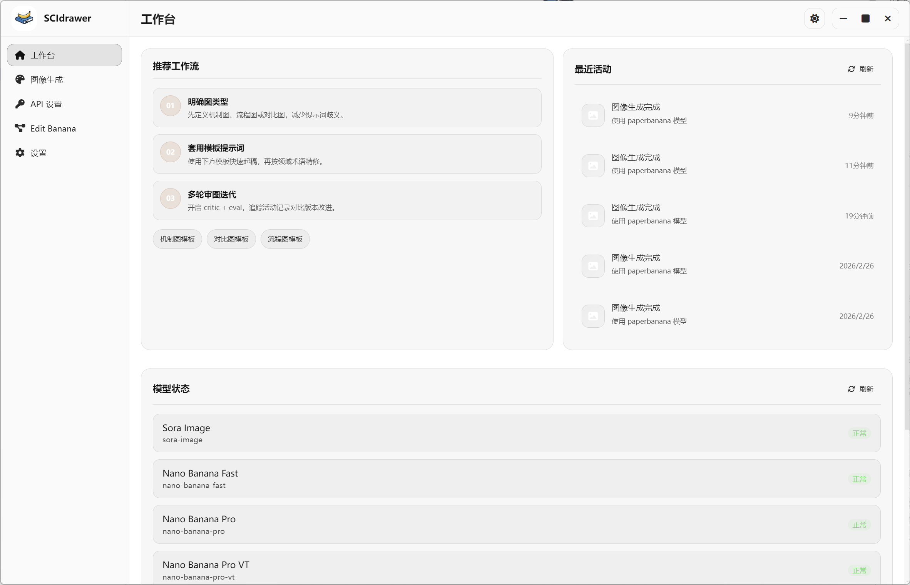
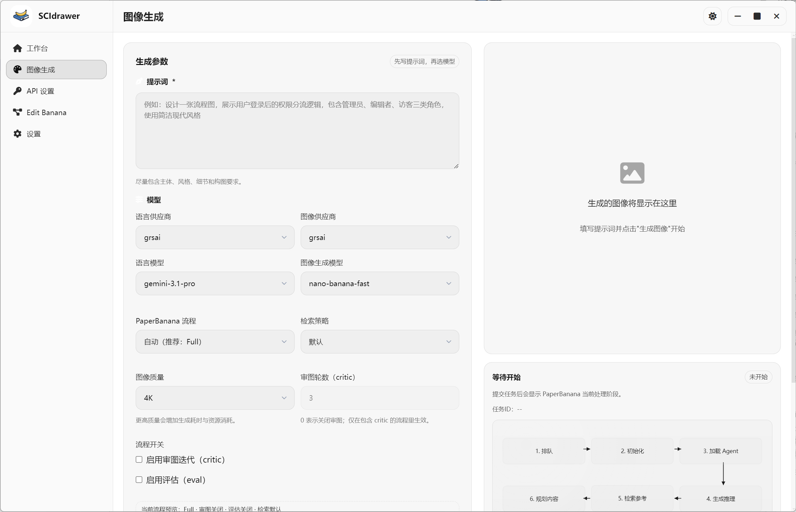
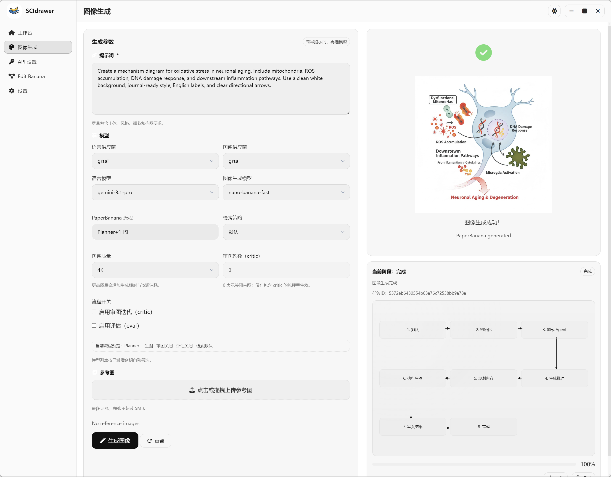

<p align="center">
  
</p>
<p align="center"><em>"Vibe your chart like vibing code."</em></p>

# SCIdrawer

> 面向 SCI 科研绘图的 AI 工作台：提示词生图 + 多阶段流程 + 图片转 DrawIO。

[English](./README_EN.md) | 中文

[](https://www.python.org/) [](https://flask.palletsprojects.com/) [](https://www.electronjs.org/) [](./LICENSE)

## 项目简介

SCIdrawer 用于缩短科研绘图从“想法”到“可投稿图”的路径，提供：

- 文本/参考图驱动的科研插图生成；
- PaperBanana 多阶段流程（检索、规划、审图、评估）；
- Edit-Banana 集成：图片转 `.drawio`；
- Web + Electron 桌面一体化使用体验。

## 主要功能

- **图像生成工作台**：提示词、模型、参考图统一控制。
- **流程模式切换**：支持 `vanilla`、`planner`、`critic`、`full` 等。
- **模型与密钥管理**：支持多供应商路由与密钥切换。
- **图片转 DrawIO**：上传图片后导出结构化流程图文件。

## 模型服务说明（不是广告）

- `GRSAI` 地址：`https://grsai.com/`
- `Openrouter`：`https://openrouter.ai`
- 这个链接放在这里是为了“开箱即连”，不是广告位招租。
- 如果你有自己的服务地址，也完全可以替换，但是可能需要自己适配或提交issue和PR.

## NOTE

目前作者测试了deepseek+grsai、grsai+grsai、openrouter+grsai的组合，其他组合由于没有API Key没有进行测试，可能会出现Bug！

Edit Banana实测效果未达到预期，正在优化！

## 快速开始

### 1) 后端启动（Flask）

```bash
python -m venv .venv
# Windows
.venv\Scripts\activate
# macOS/Linux
# source .venv/bin/activate

pip install -r requirements.txt
python app.py
```

访问：`http://127.0.0.1:<PORT>`（代码默认 `5001`，示例常用 `1200`）。

### 2) 桌面启动（Electron）

```bash
cd electron
npm install
npm run start
```

## 界面预览

下面两张为系统界面图：

### 工作台



### 图像生成





## 文档

- [贡献指南](./doc/CONTRIBUTING.md)
- [行为准则](./doc/CODE_OF_CONDUCT.md)
- [安全策略](./doc/SECURITY.md)
- [变更日志](./doc/CHANGELOG.md)
- [用户手册](./doc/USER_MANUAL.md)

## 许可证

MIT，见 [LICENSE](./LICENSE)。
